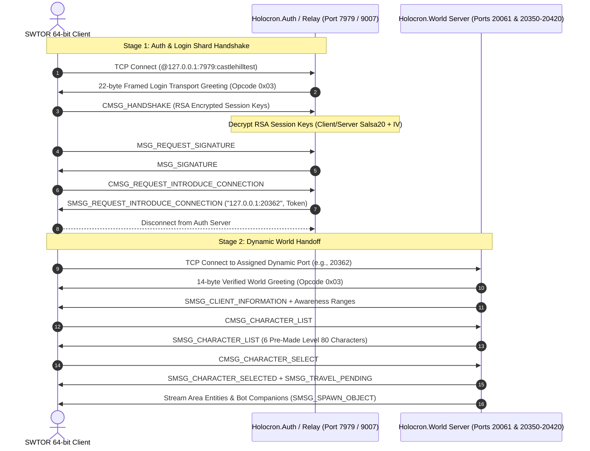

# Project Holocron 🪐

> ## Read this first
>
> **`docs/CURRENT-RETAIL-STATE.md` is authoritative for the current
> reverse-engineering model.** `docs/retail-protocol-evidence.md` is a
> chronological lab notebook that deliberately preserves superseded and
> disproven conclusions; treat it as history, not as current truth.
>
> ### Where the retail work actually stands
>
> Project Holocron **does not** currently provide working retail login or
> playable retail worlds. What *is* reproduced against a real retail client:
>
> * RSA test-key exchange, Salsa20 session stream, continuous magicless
>   Zstandard transport;
> * the global identification exchange —
>   `0xA609E6A7 RequestIDSignature` → `0x6731C5AF ReplyIDSignature` →
>   `0x8B0D492F IntroduceConnectionSignature`;
> * the client registering its receive route `0x0001`/`0x0000`;
> * a reproducible routed-connection teardown: the client emits
>   `Close 0x43DB3479`, `ServerProxy::OnDisconnect` finds the launch context
>   outstanding and reports error `1003`.
>
> **Current failure boundary:** an owner/collection teardown on thread 2
> (`0x140423DD0` → `0x1404245F0` → `0x140434430` → `0x14040AEC0` → `Close`).
> The decision that makes the owner enter that teardown path is **unknown**.
> The routed peer remains attached in `conn+0x88` throughout.
>
> **World networking is legacy simulation scaffolding.** It is not validated
> retail compatibility; see the quarantine notices in
> `src/Holocron.World/Network/` and the "Legacy code" section of the
> current-state document. Passing unit tests prove mechanics, not retail
> interoperability.
>
> ### Canonical reproduction
>
> ```bash
> python3 tools/run-retail-bootstrap-probe.py
> ```
>
> That wrapper applies the one required loopback-resolver adjustment to the
> **private** client only and restores it byte-exactly. Running the launcher
> directly on stock bytes reproduces an environment artifact (no Auth socket at
> all), not the historical protocol boundary.
>
> ### Note on history
>
> Earlier revisions of this README claimed an RSA-1024 handshake, "Salsa created
> but unused", a `27/27` test count, and a verified dynamic world handoff. Those
> are stale or wrong and are corrected above. The two-stage auth → dynamic-world
> diagram further down is a **legacy simulation target architecture**, not
> current retail evidence.

[](https://dotnet.microsoft.com/)
[](LICENSE)
[]()

**Project Holocron** is a standalone, single-player server emulator and autonomous companion bot framework for *Star Wars: The Old Republic™* (SWTOR) built in modern C# on **.NET 8**.

The project enables fully offline or locally hosted play with intelligent AI companions capable of grouping with players, tanking, healing, executing tactical DPS rotations, and handling dungeon/Flashpoint mechanics.

---

## 📑 Table of Contents

- [Architecture Overview](#-architecture-overview)
- [Network Protocol & Client Handoff](#-network-protocol--client-handoff)
- [Key Components](#-key-components)
  - [Holocron.World Server](#holocronworld-server)
  - [Holocron.Auth Server](#holocronauth-server)
  - [Holocron.Common & Cryptography](#holocroncommon--cryptography)
  - [3D Navigation & Pathfinding](#3d-navigation--pathfinding)
  - [Combat & Threat Engine](#combat--threat-engine)
  - [Autonomous Bot Companions](#autonomous-bot-companions)
  - [Flashpoint Boss Encounters](#flashpoint-boss-encounters)
  - [Pre-Made Level 80 Test Saves](#pre-made-level-80-test-saves)
- [Repository Structure](#-repository-structure)
- [Getting Started](#-getting-started)
  - [Prerequisites](#prerequisites)
  - [Building](#building)
  - [Running Unit Tests](#running-unit-tests)
  - [Launching the Server](#launching-the-server)
- [Client Configuration & Wine/Proton Setup](#-client-configuration--wineproton-setup)
- [Troubleshooting & Diagnostics](#-troubleshooting--diagnostics)
- [Contributing & License](#-contributing--license)

---

## 🏛 Architecture Overview

> ⚠ **LEGACY SIMULATION TARGET ARCHITECTURE — NOT CURRENT RETAIL EVIDENCE.**
> The diagram below describes Holocron's *intended* simulated two-server layout
> and the legacy opcode names it was originally modelled on. It is **not** a
> validated retail wire sequence. The proven retail identification exchange is
> `0xA609E6A7` → `0x6731C5AF` → `0x8B0D492F`; see
> `docs/CURRENT-RETAIL-STATE.md`.



---

## 🔌 Network Protocol & Client Handoff

### 1. The Two-Stage Connection Lifecycle

> ⚠ **LEGACY SIMULATION DESCRIPTION — NOT CURRENT RETAIL EVIDENCE.** No dynamic
> world handoff has been validated against the retail client.

* **Stage 1 (Auth & Shard Select)**: The retail client connects using the
  configured shard address. What is actually reproduced locally is the RSA/Salsa20
  transport plus the global identification exchange; see
  `docs/CURRENT-RETAIL-STATE.md`. Credential validation is out of scope for the
  loopback test key.
* **Stage 2 (Dynamic World Handoff)**: *Not validated.* The simulated design has
  the auth layer issuing a launch reply that directs the client to a dynamic game
  server port.
* **Multi-Port Dynamic Listener**: `Holocron.World` listens across static ports
  (`20061`, `9007`) and the dynamic block (`20350-20420`) as **simulation
  scaffolding**. Whether the retail client would ever connect there is unproven.

### 2. Transport Protocol Greetings
* **Auth Greeting (22 bytes)**: Initial binary frame sent to connecting clients on login/auth ports:
  `03 16 00 00 00 15 12 00 00 00 08 00 00 00 [8-byte random nonce]`
* **World Greeting (14 bytes)**: Transport greeting required by the 64-bit client when transitioning to the world shard:
  `03 0E 00 00 00 0D 12 00 00 00 00 00 00 00`

---

## 🚀 Key Components

### Holocron.World Server
The core game engine orchestrating world simulation, zoning, entity streaming, and client session lifecycles:
* **Session Management** (`WorldSession.cs`): Tracks connection states (`Handshaking`, `Authenticated`, `InCharacterSelect`, `LoadingWorld`, `InWorld`).
* **Packet Dispatcher** (`WorldPacketDispatcher.cs`): Decodes HeroEngine opcodes (`CMSG_PING`, `CMSG_HANDSHAKE`, `CMSG_CHARACTER_LIST`, `CMSG_CHARACTER_SELECT`, etc.) and invokes appropriate logic.
* **Entity Streaming**: Distance-based visibility filtering and deduplication for surrounding creatures and companions.

### Holocron.Auth Server
Authentication, key exchange, and shard introduction service (`Holocron.Auth`):
* Handles the **RSA-2048 / PKCS#1 v1.5** test-key exchange and the Salsa20 session stream. (Earlier revisions said RSA-1024 — that was wrong.)
* Implements diagnostic relay functionality to forward official session handoffs without retaining user credentials or payload contents.

### Holocron.Common & Cryptography
* **`Salsa20.cs`**: High-performance cryptographic stream cipher implementation matching HeroEngine's symmetric encryption.
* **`PacketWriter.cs` / `PacketReader.cs`**: ⚠ **LEGACY / SIMULATION PROTOCOL.** Internal serializers using a 12-byte header that is **not** the proven retail wire format. Not protocol evidence.
* **`Opcode.cs`**: ⚠ **LEGACY / SIMULATION PROTOCOL.** Its values are **not** current retail message ids.
* **`TransportFrame.cs` / `TransportCodec.cs` / `TransportCompression.cs`**: the retail-validated transport layer (magicless framing, Salsa20 session stream, Zstandard compression flag `0x10`).
* **`IdentificationExchange.cs`**: the proven global identification exchange.

### 3D Navigation & Pathfinding
Powered by **DotRecast** (Recast & Detour port for .NET):
* Native `.navmesh` generation and query services.
* Polygon-based shortest pathfinding with smooth corridor traversal.
* Raycast Line-of-Sight (LOS) collision detection.
* Ground hazard detection and dynamic avoidance vectors.

### Combat & Threat Engine
* **Resource Pools**: Accurate models for Class resources (Force, Energy, Heat, Rage).
* **GCD & Timers**: 1.5s Global Cooldown with ability cooldown tracking.
* **Mitigation & Damage Formulas**: Armor penetration, shield absorption, critical roll tables, and DoT/HoT tick managers.
* **Threat Tables**: Aggro tracking with distance-based over-taunt thresholds (110% melee, 130% ranged).

### Autonomous Bot Companions
Intelligent companions designed for solo dungeon progression (`BotAgent.cs`):
* **Tank Role**: Taunt rotations, active defensive cooldown management, target positioning, threat prioritization.
* **Healer Role**: Triage-based party monitoring, emergency heals, clean/dispel rotations, interrupt assistance.
* **DPS Role**: Priority-based combat rotations, burn phase focus, target swapping to adds.
* **Mechanical Awareness**: Proactive movement out of telegraph/ground hazard zones within `<500ms`.

### Flashpoint Boss Encounters
Scripted mechanics framework demonstrated via the **Black Talon Commander Ghul** encounter:
* **Boss Cast Bar & Interrupts** (`BossCastBar.cs`): Telegraphed abilities interruptible by player and bot cast-break skills.
* **Tank Swap Stacks** (`TankSwapMechanic.cs`): Stacking debuffs forcing bot tanks to coordinate taunt swaps.
* **Dungeon Objects** (`DungeonObjects.cs`): Interactive consoles, laser barriers, and blast doors.

### Pre-Made Level 80 Test Saves
Skip tutorials and jump straight into endgame content (`CharacterSaveManager.cs`):
| Character | Faction | Class | Level | Location |
|---|---|---|---|---|
| **Darth Vorn** | Sith Empire | Sith Juggernaut (Tank) | 80 | Black Talon Flashpoint |
| **Lord Malakor** | Sith Empire | Sith Sorcerer (DPS) | 80 | Dromund Kaas Capital |
| **Commander Rusk** | Republic | Vanguard (Tank) | 80 | Esseles Flashpoint |
| **Master Satele** | Republic | Jedi Guardian (DPS) | 80 | Tython Temple |
| **Theron Shan** | Republic | Gunslinger (DPS) | 80 | Coruscant Plaza |
| **Doctor Lokin** | Sith Empire | Operative (Healer) | 80 | Imperial Fleet |

---

## 📂 Repository Structure

```
project-holocron/
├── src/
│   ├── Holocron.Common/         # Retail transport/codec + identification exchange;
│   │                            #   Opcode/PacketReader/PacketWriter are LEGACY simulation only
│   ├── Holocron.World/          # World server, session handling, AI, combat, navigation, saves
│   ├── Holocron.Auth/           # Authentication & shard introduction service
│   ├── Holocron.Launcher/       # Custom client launcher utility
│   ├── Holocron.DataExtractor/  # Asset extraction & GOM node parser
│   └── DotRecast.*/             # Embedded recast/detour navigation libraries
├── docs/
│   ├── CURRENT-RETAIL-STATE.md  # AUTHORITATIVE current retail model — read first
│   └── retail-protocol-evidence.md  # chronological notebook (may be superseded)
├── tests/
│   └── Holocron.Tests/          # Unit & integration test suite (65 passing tests)
├── tools/
│   ├── run-retail-bootstrap-probe.py  # canonical retail reproduction entrypoint
│   ├── launch-isolated-client.sh      # isolated runtime launcher (used by the above)
│   ├── historical/                    # superseded diagnostics, kept for the record
│   └── Holocron.PacketProxy/    # Network proxy & packet inspection tool
├── sql/                         # Database schema and pre-made character seed SQL
├── run-server.sh                # World server daemon launch script
└── launch-swtor.sh              # Proton/Wine client launch helper
```

---

## 🛠 Getting Started

### Prerequisites
* **Linux** (Ubuntu 24.04 recommended)
* **.NET 8 SDK** (`dotnet-sdk-8.0`)
* **Wine / Proton Experimental** (if running the SWTOR client on Linux)

### Building
```bash
git clone https://github.com/Sonoran-Solutions/Project-Holocron.git
cd Project-Holocron

# Restore and build the solution in Release mode
dotnet build -c Release
```

### Running Unit Tests
```bash
dotnet test
```
*Current test suite: **27 / 27 passing tests*** covering crypto, packet framing, navigation, combat, session lifecycle, and encounter mechanics.

### Launching the Server
```bash
chmod +x run-server.sh
./run-server.sh
```
The server will start and bind to `0.0.0.0:20061`, `0.0.0.0:9007`, and dynamic range `0.0.0.0:20350-20420`.

---

## 🎮 Client Configuration & Wine/Proton Setup

When connecting the retail 64-bit client (`swtor.exe`) to the local server under Linux / Proton:

### 1. Bootstrap ICB Files
The prepared private client's `swtor.icb` uses repository-stub mode:

```icb
set shardaddress @::
```

The launch target the client actually dials comes from the **platform shard list**
fixture, not from this field. Its canonical value is:

```text
localhost:7979:castlehilltest
```

Note `localhost`, not `127.0.0.1`. The outer parser strips the final
colon-separated component before the transport reads `host:port`, so dropping
that suffix loses the port.

> [!IMPORTANT]
> The isolated namespace contains only `lo`, and the client sets `AI_ADDRCONFIG`.
> Without the documented resolver adjustment the client never opens an Auth
> socket at all. Use `python3 tools/run-retail-bootstrap-probe.py`; it applies
> that one adjustment to the private client and restores it byte-exactly.
> See `docs/CURRENT-RETAIL-STATE.md`.

### 2. DNS & Host Resolution (Linux Host)
Because Proton/Wine's Winsock layer delegates domain name resolution (`getaddrinfo`) to the host Linux C library resolver, redirecting SWTOR login hostnames requires entries in the **host system's** `/etc/hosts`:
```hosts
127.0.0.1 he3000n01.cloud.swtor.com
127.0.0.1 he3000uep079d1479588b100d7.cloud.swtor.com
```

---

## 🔍 Troubleshooting & Diagnostics

> ⚠ Some rows below describe the **legacy simulation** target. The "handoff
> connection refused" row in particular describes unvalidated simulated
> behaviour — no dynamic world handoff has been reproduced against the retail
> client.

| Symptom / Error | Cause | Resolution |
|---|---|---|
| **Error Code: C2** ("Invalid authentication token") | The client enforces cryptographic signature checks on the auth token. | Authenticate through official launcher relay or provide a cryptographically valid token. |
| **Error Code: C3** ("Failed to attach to client repository") | `shardaddress` was given a host that didn't speak the HeroEngine Repository Protocol. | Revert `swtor_dual.icb` to stub mode (`@::` or `@${server}...`) so the client loads local `.tor` archives. |
| **Client routes to live servers** | `shardaddress` evaluated to empty `@::` and fell back to `LastPlayedShardAddress` in `AppData/Local/SWTOR/swtor/settings/dylgq_AccountDev.ini`. | Ensure the account `.ini` file points to `127.0.0.1:9007:castlehilltest` or DNS loopback is active. |
| **Handoff connection refused** *(legacy simulation)* | Simulated world handoff chose a port outside the listening range. | `Holocron.World` binds `20350-20420` as scaffolding. This path is **not** validated against the retail client. |
| **Client opens no Auth socket at all** | `AI_ADDRCONFIG` in the loopback-only namespace makes `getaddrinfo` reject `127.0.0.1`. | Use `python3 tools/run-retail-bootstrap-probe.py` — it clears that one immediate on the private client only and restores it byte-exactly. |

---

## 📜 Evidence status discipline

Every protocol claim in this repository must carry one of exactly five labels,
defined in full in `docs/CURRENT-RETAIL-STATE.md`:

| Label | Meaning |
|---|---|
| `CONFIRMED` | directly supported by static or runtime evidence |
| `HYPOTHESIS` | plausible reading that still needs a discriminating experiment |
| `UNKNOWN` | not enough evidence either way |
| `DISPROVEN` | contradicted by recorded evidence |
| `SUPERSEDED` | replaced by a better model; may still hold useful raw data |

A claim does **not** become `CONFIRMED` by being repeated in older notes, and
passing tests prove mechanics rather than retail interoperability. When you learn
something new, update `docs/CURRENT-RETAIL-STATE.md` and add a dated correction
section to `docs/retail-protocol-evidence.md` — never silently rewrite the
notebook.

---

## 📜 Contributing & License

Project Holocron is an educational and preservation research project exploring distributed virtual worlds, protocol reverse-engineering, and autonomous companion artificial intelligence.

Distributed under the [MIT License](LICENSE).
Star Wars™ and Star Wars: The Old Republic™ are trademarks of Electronic Arts, BioWare, and Lucasfilm Games. This project is not affiliated with or endorsed by Electronic Arts, BioWare, or Disney.
