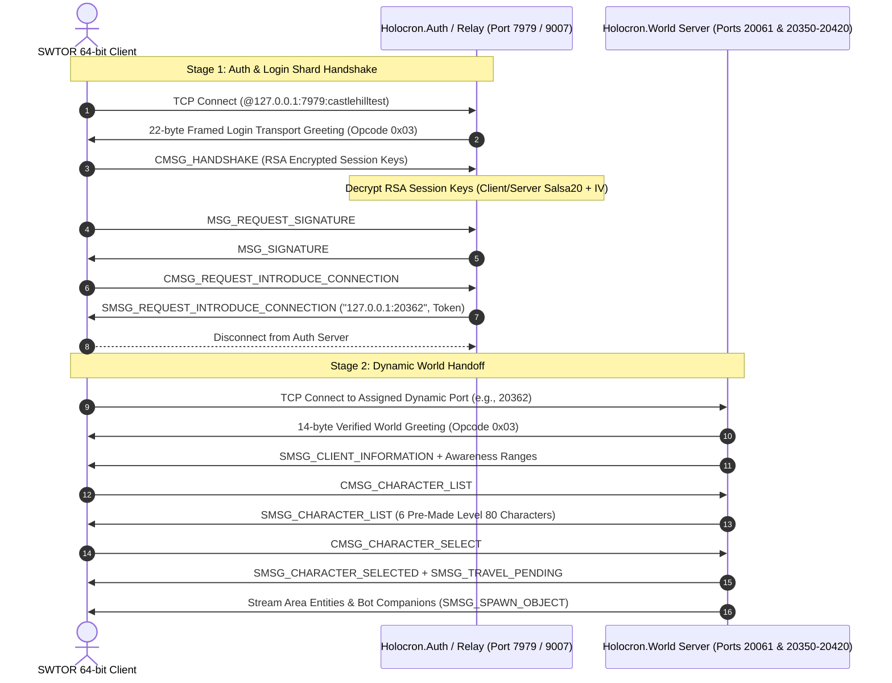

# Project Holocron 🪐

[](https://dotnet.microsoft.com/)
[](LICENSE)
[]()

**Project Holocron** is a standalone, single-player server emulator and autonomous companion bot framework for *Star Wars: The Old Republic™* (SWTOR) built in modern C# on **.NET 8**.

The project enables fully offline or locally hosted play with intelligent AI companions capable of grouping with players, tanking, healing, executing tactical DPS rotations, and handling dungeon/Flashpoint mechanics.

---

## 📑 Table of Contents

- [Architecture Overview](#-architecture-overview)
- [Network Protocol & Client Handoff](#-network-protocol--client-handoff)
- [Key Components](#-key-components)
  - [Holocron.World Server](#holocronworld-server)
  - [Holocron.Auth Server](#holocronauth-server)
  - [Holocron.Common & Cryptography](#holocroncommon--cryptography)
  - [3D Navigation & Pathfinding](#3d-navigation--pathfinding)
  - [Combat & Threat Engine](#combat--threat-engine)
  - [Autonomous Bot Companions](#autonomous-bot-companions)
  - [Flashpoint Boss Encounters](#flashpoint-boss-encounters)
  - [Pre-Made Level 80 Test Saves](#pre-made-level-80-test-saves)
- [Repository Structure](#-repository-structure)
- [Getting Started](#-getting-started)
  - [Prerequisites](#prerequisites)
  - [Building](#building)
  - [Running Unit Tests](#running-unit-tests)
  - [Launching the Server](#launching-the-server)
- [Client Configuration & Wine/Proton Setup](#-client-configuration--wineproton-setup)
- [Troubleshooting & Diagnostics](#-troubleshooting--diagnostics)
- [Contributing & License](#-contributing--license)

---

## 🏛 Architecture Overview

Project Holocron mirrors the reverse-engineered HeroEngine two-server architecture:



---

## 🔌 Network Protocol & Client Handoff

### 1. The Two-Stage Connection Lifecycle
* **Stage 1 (Auth & Shard Select)**: The retail client begins its connection using the configured shard address. When official authentication is utilized with the live test shard (`castlehilltest`), credentials and session tokens are validated.
* **Stage 2 (Dynamic World Handoff)**: The authentication layer issues `SMSG_REQUEST_INTRODUCE_CONNECTION` (or `ReplyGameLaunch`), which directs the client to connect to a dynamic game server port (typically in the `20350-20420` range, e.g., `20362`).
* **Multi-Port Dynamic Listener**: `Holocron.World` simultaneously listens across both static ports (`20061`, `9007`) and the entire dynamic handoff block (`20350-20420`), ensuring incoming client handoffs are intercepted regardless of the dynamically assigned port.

### 2. Transport Protocol Greetings
* **Auth Greeting (22 bytes)**: Initial binary frame sent to connecting clients on login/auth ports:
  `03 16 00 00 00 15 12 00 00 00 08 00 00 00 [8-byte random nonce]`
* **World Greeting (14 bytes)**: Transport greeting required by the 64-bit client when transitioning to the world shard:
  `03 0E 00 00 00 0D 12 00 00 00 00 00 00 00`

---

## 🚀 Key Components

### Holocron.World Server
The core game engine orchestrating world simulation, zoning, entity streaming, and client session lifecycles:
* **Session Management** (`WorldSession.cs`): Tracks connection states (`Handshaking`, `Authenticated`, `InCharacterSelect`, `LoadingWorld`, `InWorld`).
* **Packet Dispatcher** (`WorldPacketDispatcher.cs`): Decodes HeroEngine opcodes (`CMSG_PING`, `CMSG_HANDSHAKE`, `CMSG_CHARACTER_LIST`, `CMSG_CHARACTER_SELECT`, etc.) and invokes appropriate logic.
* **Entity Streaming**: Distance-based visibility filtering and deduplication for surrounding creatures and companions.

### Holocron.Auth Server
Authentication, key exchange, and shard introduction service (`Holocron.Auth`):
* Handles RSA-1024 / Salsa20 encrypted handshakes.
* Implements diagnostic relay functionality to forward official session handoffs without retaining user credentials or payload contents.

### Holocron.Common & Cryptography
* **`Salsa20.cs`**: High-performance cryptographic stream cipher implementation matching HeroEngine's symmetric encryption.
* **`PacketWriter.cs` / `PacketReader.cs`**: Binary serializers with HeroEngine header support, variable-length packed integers, and length-prefixed strings.
* **`Opcode.cs`**: Mappings for HeroEngine transport, sub-system, character lifecycle, combat, movement, and RPC opcodes.

### 3D Navigation & Pathfinding
Powered by **DotRecast** (Recast & Detour port for .NET):
* Native `.navmesh` generation and query services.
* Polygon-based shortest pathfinding with smooth corridor traversal.
* Raycast Line-of-Sight (LOS) collision detection.
* Ground hazard detection and dynamic avoidance vectors.

### Combat & Threat Engine
* **Resource Pools**: Accurate models for Class resources (Force, Energy, Heat, Rage).
* **GCD & Timers**: 1.5s Global Cooldown with ability cooldown tracking.
* **Mitigation & Damage Formulas**: Armor penetration, shield absorption, critical roll tables, and DoT/HoT tick managers.
* **Threat Tables**: Aggro tracking with distance-based over-taunt thresholds (110% melee, 130% ranged).

### Autonomous Bot Companions
Intelligent companions designed for solo dungeon progression (`BotAgent.cs`):
* **Tank Role**: Taunt rotations, active defensive cooldown management, target positioning, threat prioritization.
* **Healer Role**: Triage-based party monitoring, emergency heals, clean/dispel rotations, interrupt assistance.
* **DPS Role**: Priority-based combat rotations, burn phase focus, target swapping to adds.
* **Mechanical Awareness**: Proactive movement out of telegraph/ground hazard zones within `<500ms`.

### Flashpoint Boss Encounters
Scripted mechanics framework demonstrated via the **Black Talon Commander Ghul** encounter:
* **Boss Cast Bar & Interrupts** (`BossCastBar.cs`): Telegraphed abilities interruptible by player and bot cast-break skills.
* **Tank Swap Stacks** (`TankSwapMechanic.cs`): Stacking debuffs forcing bot tanks to coordinate taunt swaps.
* **Dungeon Objects** (`DungeonObjects.cs`): Interactive consoles, laser barriers, and blast doors.

### Pre-Made Level 80 Test Saves
Skip tutorials and jump straight into endgame content (`CharacterSaveManager.cs`):
| Character | Faction | Class | Level | Location |
|---|---|---|---|---|
| **Darth Vorn** | Sith Empire | Sith Juggernaut (Tank) | 80 | Black Talon Flashpoint |
| **Lord Malakor** | Sith Empire | Sith Sorcerer (DPS) | 80 | Dromund Kaas Capital |
| **Commander Rusk** | Republic | Vanguard (Tank) | 80 | Esseles Flashpoint |
| **Master Satele** | Republic | Jedi Guardian (DPS) | 80 | Tython Temple |
| **Theron Shan** | Republic | Gunslinger (DPS) | 80 | Coruscant Plaza |
| **Doctor Lokin** | Sith Empire | Operative (Healer) | 80 | Imperial Fleet |

---

## 📂 Repository Structure

```
project-holocron/
├── src/
│   ├── Holocron.Common/         # Protocol, packet reader/writer, opcodes, crypto (Salsa20)
│   ├── Holocron.World/          # World server, session handling, AI, combat, navigation, saves
│   ├── Holocron.Auth/           # Authentication & shard introduction service
│   ├── Holocron.Launcher/       # Custom client launcher utility
│   ├── Holocron.DataExtractor/  # Asset extraction & GOM node parser
│   └── DotRecast.*/             # Embedded recast/detour navigation libraries
├── tests/
│   └── Holocron.Tests/          # Unit & integration test suite (27 passing tests)
├── tools/
│   └── Holocron.PacketProxy/    # Network proxy & packet inspection tool
├── sql/                         # Database schema and pre-made character seed SQL
├── run-server.sh                # World server daemon launch script
└── launch-swtor.sh              # Proton/Wine client launch helper
```

---

## 🛠 Getting Started

### Prerequisites
* **Linux** (Ubuntu 24.04 recommended)
* **.NET 8 SDK** (`dotnet-sdk-8.0`)
* **Wine / Proton Experimental** (if running the SWTOR client on Linux)

### Building
```bash
git clone https://github.com/Sonoran-Solutions/Project-Holocron.git
cd Project-Holocron

# Restore and build the solution in Release mode
dotnet build -c Release
```

### Running Unit Tests
```bash
dotnet test
```
*Current test suite: **27 / 27 passing tests*** covering crypto, packet framing, navigation, combat, session lifecycle, and encounter mechanics.

### Launching the Server
```bash
chmod +x run-server.sh
./run-server.sh
```
The server will start and bind to `0.0.0.0:20061`, `0.0.0.0:9007`, and dynamic range `0.0.0.0:20350-20420`.

---

## 🎮 Client Configuration & Wine/Proton Setup

When connecting the retail 64-bit client (`swtor.exe`) to the local server under Linux / Proton:

### 1. Bootstrap ICB Files
Ensure `swtor.icb` and `swtor_dual.icb` in `swtor/retailclient/` configure the shard address target:
```icb
set shardaddress @127.0.0.1:7979:castlehilltest
```
*(Or `@127.0.0.1:9007:castlehilltest` depending on your active auth listener port).*

> [!IMPORTANT]
> Always retain the `${server}:${port}:${instance}` or stub address format if you intend for the client to read assets from local `.tor` files instead of looking for an external repository server (which avoids Error C3).

### 2. DNS & Host Resolution (Linux Host)
Because Proton/Wine's Winsock layer delegates domain name resolution (`getaddrinfo`) to the host Linux C library resolver, redirecting SWTOR login hostnames requires entries in the **host system's** `/etc/hosts`:
```hosts
127.0.0.1 he3000n01.cloud.swtor.com
127.0.0.1 he3000uep079d1479588b100d7.cloud.swtor.com
```

---

## 🔍 Troubleshooting & Diagnostics

| Symptom / Error | Cause | Resolution |
|---|---|---|
| **Error Code: C2** ("Invalid authentication token") | The client enforces cryptographic signature checks on the auth token. | Authenticate through official launcher relay or provide a cryptographically valid token. |
| **Error Code: C3** ("Failed to attach to client repository") | `shardaddress` was given a host that didn't speak the HeroEngine Repository Protocol. | Revert `swtor_dual.icb` to stub mode (`@::` or `@${server}...`) so the client loads local `.tor` archives. |
| **Client routes to live servers** | `shardaddress` evaluated to empty `@::` and fell back to `LastPlayedShardAddress` in `AppData/Local/SWTOR/swtor/settings/dylgq_AccountDev.ini`. | Ensure the account `.ini` file points to `127.0.0.1:9007:castlehilltest` or DNS loopback is active. |
| **Handoff connection refused** | Dynamic world handoff chose a port outside the listening range. | `Holocron.World` automatically binds `20350-20420` to guarantee reception. Ensure no firewall blocks loopback. |

---

## 📜 Contributing & License

Project Holocron is an educational and preservation research project exploring distributed virtual worlds, protocol reverse-engineering, and autonomous companion artificial intelligence.

Distributed under the [MIT License](LICENSE).
Star Wars™ and Star Wars: The Old Republic™ are trademarks of Electronic Arts, BioWare, and Lucasfilm Games. This project is not affiliated with or endorsed by Electronic Arts, BioWare, or Disney.
